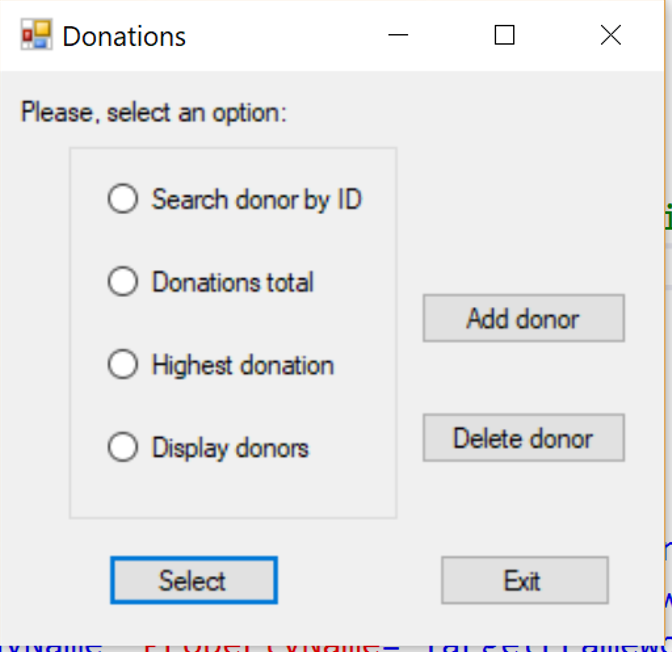
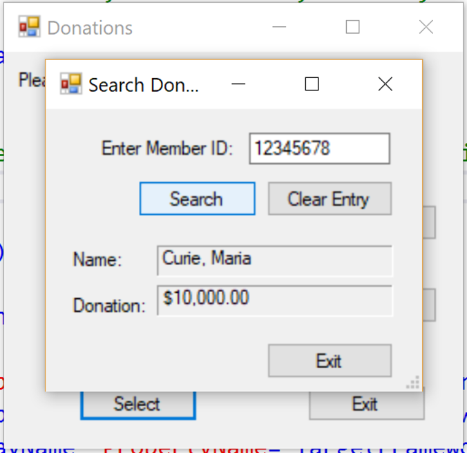
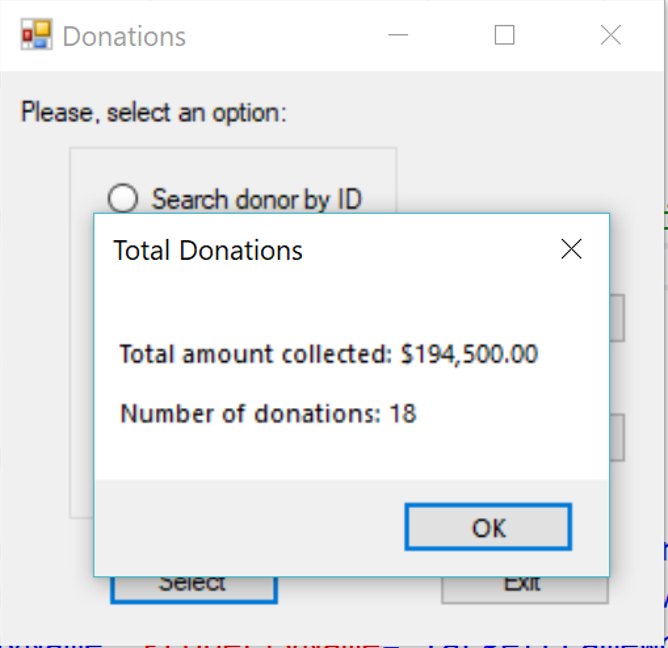
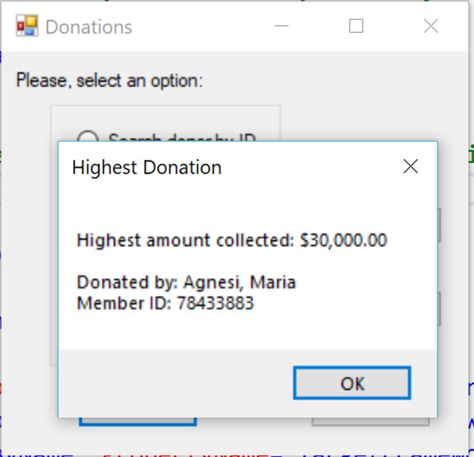
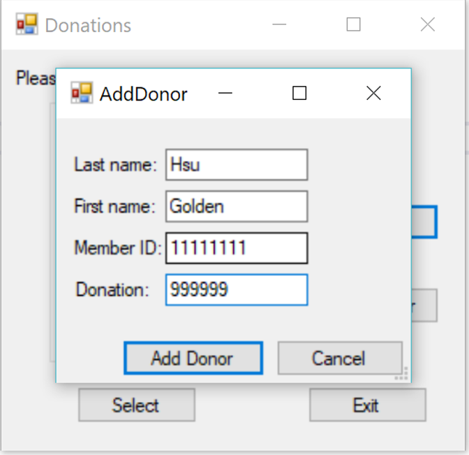
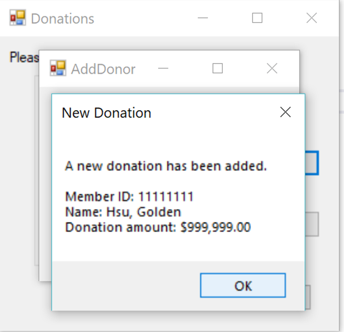

# C++ Donation Application Project
An application that make use of donors' information such as names and the amount of donation, to calculate the amount of total donation for different purposes. The donors' data is stored using a doubly linked list I implemented.

## Main 

## Search Donor

## Display total donation

## Display highest donation

## Display all donation entries

## Add a donor

